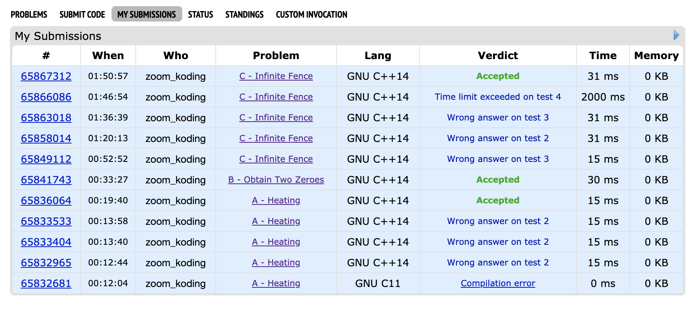

## 후기

>* A부터 C번까지 수학 문제만 내버렸다..
>* 간신히 C번까지 풀긴 했는데 제출을 어마무지하게 많이 해버렸다... 제출 횟수가 아쉬운 시험이었다.
>* C번에서 1시간 넘게 걸렸는데 D를 못본건 아쉽지만 어떻게든 C를 풀었다는 사실에 만족한다!



## A. Heating

[문제 링크](https://codeforces.com/contest/1260/problem/A)

>* 이 문제는 이해하는데만 10분이 걸렸다.(영어가 안되는건지 그냥 이해가 너무 어려웠다.)
>* 이 문제는 크게 두 경우로 나눌 수 있다.
>* (10000, 10)처럼 설치할수 있는 라디에이터 개수가 섹션의 개수보다 많거나 같은 경우와 그렇지 않은 경우이다.
>* (10000, 10)과 같은 경우에는 그냥 라디에이터를 각 위치에 1 만큼씩 배치하는게 이득이다.
>* 하지만 나머지 경우에는 총 섹션을 라디에이터 개수로 나눈 값(m)을 구하고혹시 나머지가 n만큼 있다면 m값을 가지는 애들 중에 n만큼만 1을 더해준다.

```cpp
#include <cstdio>
long long n, c, sum;
int main(){
    scanf("%lld", &n);
    while(n--){
        scanf("%lld %lld", &c, &sum);
        if(c >= sum)printf("%lld\n", sum);
        else{
            long long x = sum / c, y = sum % c;
            printf("%lld\n", x * x * (c - y) + (x + 1) * (x + 1) * y); 
        }
    }
}
```

## B. Obtain Two Zeroes

[문제 링크](https://codeforces.com/contest/1260/problem/B)

>* A번보다 B번이 훨씬 쉬운듯 했다.
>* 먼저, a, b 두 수 중에 큰 값을 a에 저장한다.
>* a값이 b의 2배보다 크다면 절대로 둘다 0이 될 수 없다.
>* 그 외의 경우에서 $a - x = 2(b - 2x)$라는 수식이 성립하는 x가 정수로 존재하면 0을 만들 수 있다.

```cpp
#include <cstdio>
#include <algorithm>
using namespace std;
long long t, a, b, x;
int main(){
    scanf("%lld", &t);
    while(t--){
        scanf("%lld %lld", &a, &b);
        if(a < b)swap(a, b);
        if(a > b * 2)printf("NO\n");
        else{
            if((2 * b - a) % 3 == 0)printf("YES\n");
            else printf("NO\n");
        }
    }
}
```

## C. Infinite Fence

[문제 링크](https://codeforces.com/contest/1260/problem/C)

>* 이 문제는 잡고 있다가 1시간 반이 지나갔다. 못풀뻔했는데 그래도 풀어서 정말 다행이다.
>* 반복된 색이 가장 많이 나올 경우는 b의 배수인 $bx$와 그 다음 배수인 $b(x+1)$ 사이에 r의 배수가 최대한 많이 들어간 경우이다.
>* $bx + 1$부터 $b(x + 1) - 1$ 사이에 a로 나누어 떨어지는 애가 최대 몇개인지 세주면 된다.
>* 이때 b와 r의 최대 공약수가 1이라면 $bx$ 바로 다음인 $bx + 1$에 r을 칠하면서 최대 개수를 셀 수있다.
>* 하지만 최대 공약수가 2나 그 보다 큰 c라는 수라면 r이 은 $bx + c$에 처음 칠해지게 되고 이에 따라 최대 개수를 세게 된다.
>* 이를 이용해 최대 b의 연속적인 두 배수사이의 최대 r의 개수를 구하고 이를 기반으로 문제를 풀어내면 된다!
>* 그리고 __gcd()라는 c++ 내장 함수를 이용하면 빠르게 최대 공약수를 구해낼 수 있다.

```cpp
#include <cstdio>
#include <algorithm>
using namespace std;

int t, r, b, k;
int main(){
    scanf("%d", &t);
    while(t--){
        scanf("%d %d %d", &r, &b, &k);
        if(r > b)swap(r, b);
        int c = __gcd(r, b);
        if(r == b)printf("OBEY\n");
        else if(((b - c - 1) / r) >= k - 1)printf("REBEL\n");
        else printf("OBEY\n");
    }
}
```

## 느낀점

>* 수학 문제였는데 3문제 였으면 진짜 선방했다.
>* 빨리 zoom_koding도 블루가 됐으면 좋겠다 ㅎㅎㅎ

```toc
```