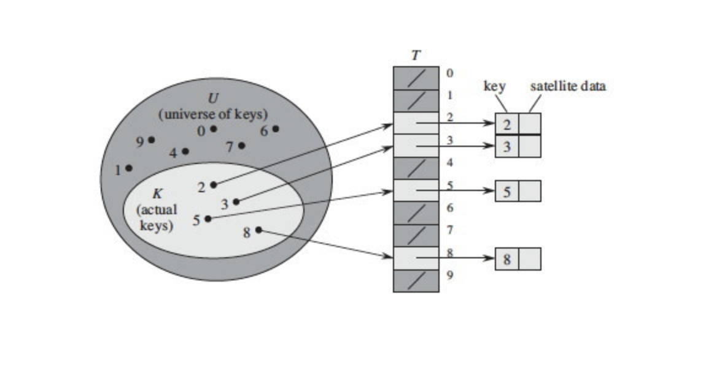
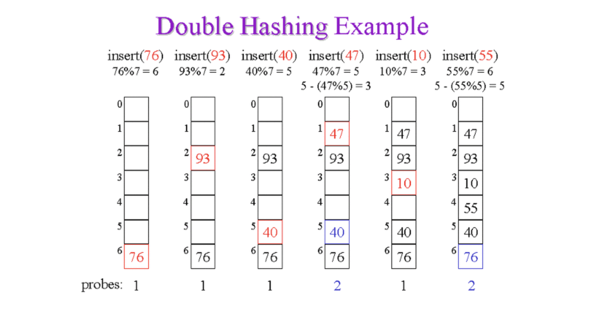

## Hash

데이터를 효율적으로 저장하고 검색하기 위해 사용되는 알고리즘. Java에서 해시는 `HashMap`, `HashSet`, `Hashtable`과 같은 자료구조에서 많이 활용함.
- 해시 알고리즘을 사용하려면 먼저 데이터의 해시 값을 계산해야 하는데, 이때 해시 함수는 객체의 속성 값을 기반으로 고유한 해시 코드를 생성.


key-value 에서 key를 테이블에 저장할 때 key값을 Hash Method를 이용해 계산을 수행한 후, 그 결과값을 배열의 인덱스로 사용하여 저장하는 방식이다. 여기서 key값을 계산하는 것이 Hash Method 이다.

```java
import java.util.HashMap;

public class HashExample {
    public static void main(String[] args) {
        HashMap<String, Integer> map = new HashMap<>();

        map.put("apple", 100);
        map.put("banana", 200);
        map.put("orange", 300);

        System.out.println("apple의 값: " + map.get("apple"));

        map.remove("banana");

        for (String key : map.keySet()) {
            System.out.println("Key: " + key + ", Value: " + map.get(key));
        }
    }
}
```

### Hashing

- HashMap과 같이 Hashing을 구현한 컬렉션 클래스에서는 Object 클래스에 정의된 hashCode()를 Hash Method로 사용한다. 

- Object 클래스에 정의된 hashCode()는 객체의 주소를 이용하는 알고리즘으로 해시 코드를 만들어내기 때문에 모든 객체에 대해 중복되지 않는 값을 제공한다.

- String 클래스의 경우 Object로 부터 상속받은 hashCode()를 오버 라이딩하여 문자열의 내용으로 해시 코드를 만들어 낸다. 서로다른 String 인스턴스 일지라도 같은 내용의 문자열을 가졌다면 hashCode()를 호출했을 때 같은 값을 얻는다.

```java
String s = "string";
String s1 = "string";
System.out.println(s.hashCode()); // -891985903
System.out.println(s1.hashCode()); // -891985903
System.out.println(s.equals(s1)); // true
```
서로 다른 두 객체에 대해 hashCode() 반환값이 같고 equals()로 비교한 결과가 true이면 같은 객체로 인식한다.

- HashMap도 같은 방법으로 객체를 구별하기 때문에 이미 존재하는 키와 동일한 값을 저장하면 기존의 값을 새로운 값으로 덮어쓴다.

```java
HashMap<String,Integer> testMap = new HashMap<String,Integer>();
testMap.put("s",2);
testMap.put("s",1);
testMap.put("s1",2);
System.out.println(testMap); // {s=1, s1=2}
```

### Direct Addressing Table



Key값을 직접 배열의 인덱스로 사용

> ex) 키값이 400이면 이는 배열의 인덱스가 400인 위치에 키 값을 저장하고 데이터를 연결한다.
> 삭제 시에는 해당 키의 위치에 NULL값을 넣어주기만 하면 됨.
> BUT, key값의 최대 크기만큼 배열이 할당 되기 때문에, 크기는 매우 큰데, 저장하고자 하는 데이터가 적다면 공간을 많이 낭비할 수 있다는 단점이 있음.

### Hash Function (해쉬함수)
Direct Addressing Table 과 달리, key값을 함수를 이용해 계산을 수행한 후, 그 결과값을 배열의 인덱스로 사용하여 저장하는 방식이다. 
- h(k)로 해쉬되었다고 하며, k의 해쉬값이라고도 한다.

<br/>

#### Collusion

충돌이란, 다른 k값이 동일한 h(k)값을 가져 동일한 slot에 저장되는 경우를 말한다. Direct Addressing Table에서는 이를 방지하기 위해서 모든 Key 값이 다르다고 전제하지만, 해쉬 테이블에서는 함수를 사용하기 때문에, 동일한 결과를 가져올 수 있기 때문에 이를 방지하기 위한 방법이 필요하다.
- 다만, 이 세상에 완전히 방지한다는 건 보장하기 힘드므로, 충돌을 방지하기 위한 방법으로 충돌을 어느 정도 허용하되, 최소화하는 방법을 사용하기도 한다.

### 1. Chaining

충돌을 허용하되 이를 최소화 하기 위한 방법 중 하나인 체이닝 방식. 동일한 해쉬값이 출력되 충돌이 일어난다면, 그 위치에 있던 데이터에 key값을 포인터로 뒤이어 연결해야한다.

따라서 첫 데이터 이후 h(k)값이 출력되는 데이터는 모두 연결리스트의 형태를 취한다. 최악의 경우 모든 데이터의 해쉬값이 일치하면서 한 인덱스에 저장되었을 경우엔 연결리스트의 탐색 시간과 동일한 선형시간을 가지고 됨.

### 2. Simple Uniform Hash
충돌을 최소화 하는 방법 중 충돌이 적은 좋은 해쉬 함수를 만드는 방법도 있음.
- 계산된 해쉬 값들은 0부터 (배열의 크기-1) 사이의 범위를 "동일한 확률"로 골고루 나타날 것.
- 각각의 해쉬값들은 서로 연관성을 가지지 않고 독립적으로 생성될 것!

### 3. Division Method
해쉬함수는 그래서 엄청나게 다양하지만, 대표적으로는 modular연산을 이용하는 방법이 있다. 특정 key를 어떤 수로 나눈 나머지를 해쉬 값으로 사용한다.

m = 100이면 K mod m 이라면 0부터 99까지의 범위를 가진다. 이 범위의 m은 해쉬 테이블의 성능을 크게 좌우하는데, m의 크기는 보통 키의 수의 3배가 적당하다고 한다. (적재율 30프로 정도까지 충돌 x)

### 4. Double Hashing



Secondary Clustering 을 해결하기 위한 방식. 해쉬 함수 2개로 구성.
h(k) = k mod m
h2(k) = k mod m2
h(k,i) = (h1(k) + i * h2(k)) mod m

<br/>


## 할리갈리 백준 27160

```java
//생략

public class Main {
    /*
    과일이 5개 있는 경우에만 YES 아니면 모두 NO
    MAP을 이용해 전체 갯수를 담은 후 5개 있으면 YES / 아니면 NO
    */

  public static void main(String[] args) throws IOException {
    BufferedReader br = new BufferedReader(new InputStreamReader(System.in));
    int count = Integer.parseInt(br.readLine());
    HashMap<String, Integer> fruit = new HashMap<>();

    for (int i = 0; i < count; i++) {
      String[] split = br.readLine().split(" ");
      int existValue = fruit.getOrDefault(split[0], 0);
      fruit.put(split[0], existValue + Integer.parseInt(split[1]));
    }

    if (fruit.containsValue(5)) {
      System.out.println("YES");
    } else {
      System.out.println("NO");
    }
  }
}
```

간단 깔끔.
그냥 `BufferedReader` 이 파트만 잘 써보기.
- BufferedWriter를 사용하려면?

```java
//생략
import java.io.BufferedWriter;

public class Main {

  public static void main(String[] args) throws IOException {
    BufferedReader br = new BufferedReader(new InputStreamReader(System.in));
    BufferedWriter bw = new BufferedWriter(new OutputStreamWriter(System.out));
    int count = Integer.parseInt(br.readLine());
    HashMap<String, Integer> fruit = new HashMap<>();

    for (int i = 0; i < count; i++) {
      String[] split = br.readLine().split(" ");
      int existValue = fruit.getOrDefault(split[0], 0);
      fruit.put(split[0], existValue + Integer.parseInt(split[1]));
    }

    if (fruit.containsValue(5)) {
      bw.write("YES\n");
    } else {
      bw.write("NO\n");
    }
    bw.flush();
    bw.close();
  }
}
```


## 전주 듣고 노래 맞히기 백준 31562


```java

import java.io.BufferedReader;
import java.io.IOException;
import java.io.InputStreamReader;
import java.util.ArrayList;

public class Main {
    /*
    첫 3개의 코드를 입력 받을 때마다 노래 리스트를 순회해서 맨 앞 3개의 코드와 일치하는 것이 있다면 리스트에 넣는다.
    순회가 끝났을 때, 리스트의 사이즈가 1이면 그 요소를 출력 / 1보다 크면 ? 출력 / 0이면 ! 출력
     */
    public static void main(String[] args) throws IOException {
        BufferedReader br = new BufferedReader(new InputStreamReader(System.in));

        String[] NM = br.readLine().split(" ");

        int N = Integer.parseInt(NM[0]); // 음을 아는 노래의 개수 N
        int M = Integer.parseInt(NM[1]); // 맞출 노래의 개수 M

        String[][] musicInfo = new String[N][]; // [제목 길이, 제목, 음이름]이 담긴 이차원 배열 선언

        for(int i = 0; i < N; i++) {
            musicInfo[i] = br.readLine().split(" "); // 음악 정보 초기화
        }

        for(int j = 0; j < M; j++) {
            int cnt = 0;
            String code = br.readLine().replaceAll(" ", ""); // 입력 받은 음이름을 공백 없이 code에 초기화
            ArrayList<String> list = new ArrayList<>(); // 정환이가 맞춘 음악 저장하기 위한 list 초기화

            for(int i = 0; i < N; i++) {
                // code와 가장 맨앞부터 3개의 음이름 같으면 list에 저장
                if((musicInfo[i][2] + musicInfo[i][3] + musicInfo[i][4]).equals(code)) {
                    list.add(musicInfo[i][1]);
                }
            }

            int listSize = list.size();

            if(listSize == 1) { // size 1이면 제목 출력
                System.out.println(list.get(0));
            }
            else if(listSize > 1) { // size 1보다 크면 ? 출력
                System.out.println("?");
            }
            else { // size 0이면 ! 출력
                System.out.println("!");
            }
        }
    }
}

```


```toc
```    