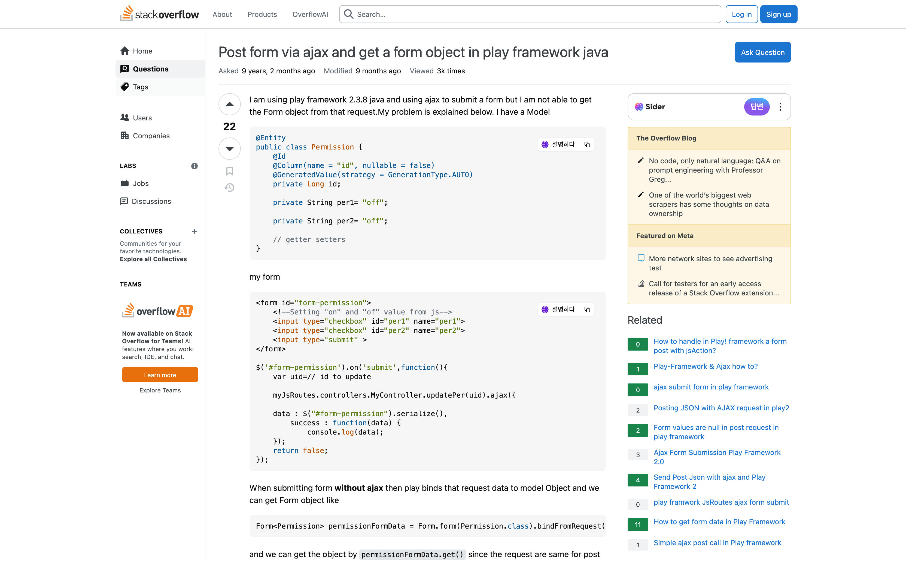
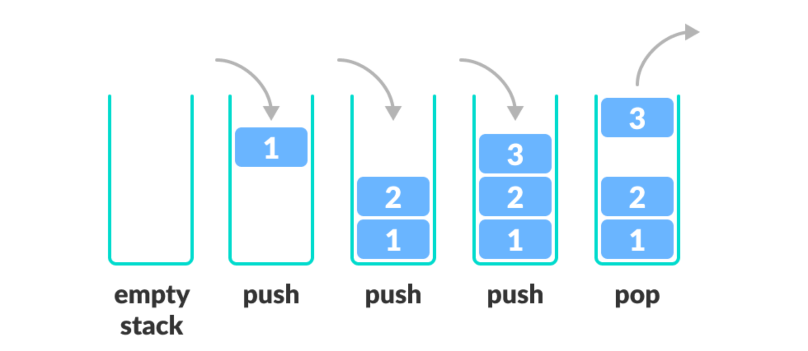
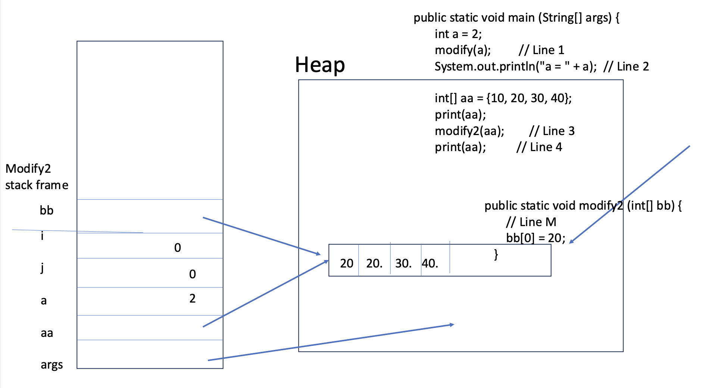
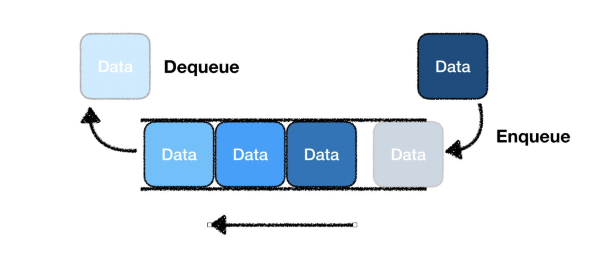
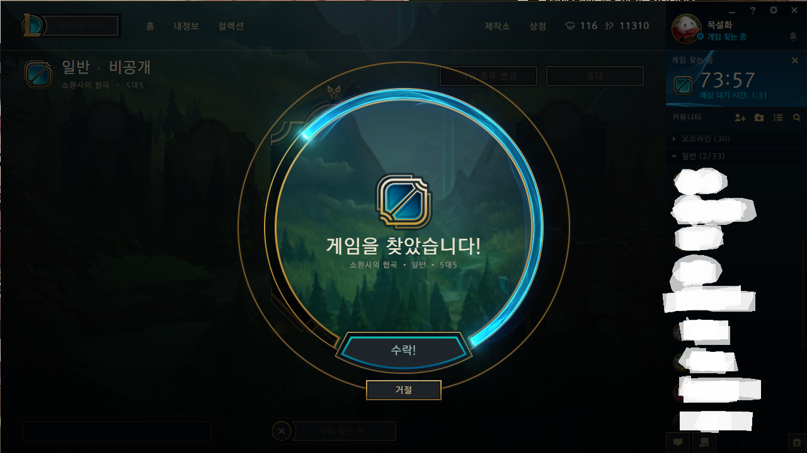

## Stack(LIFO)
데이터의 입력과 출력 순서는 후입선출(FILO)방식이다. 데이터를 제한적으로 접근할 수 있는 구조이고, 한쪽 끝에서만 자료를 넣거나 뺄 수 있는 구조 (DFS)
- 스택은 거의 모든 애플리케이션을 만들 때 사용되는 자료구조로서, 스택과 연관된 알고리즘을 제대로 이해하느냐 못하느냐에 따라 기본 알고리즘을 설계할 수 있느냐 없느냐가 결정


### Stackoverflow

꽉 찬 스택에 요소를 삽입하고자 할 때 스택에 요소가 넘쳐서 에러가 발생하는 것을 스택 버퍼 오버플로(stack buffer overflow)


*우리가 흔히 아는 stackoverflow도 이와 같은 의미에서 가져왔다*

### Stack 자료구조



- LIFO(Last In First Out), 후입선출(後入先出) 구조이다. 마지막에 들어온게 첫번째로 빠져나간다.
- 그래서 직전의 데이터를 빠르게 갖고 올 수 있다.
- 뒤로 가기, 실행 취소(redo/undo), 그리고 컴퓨터 구조에서의 스택 메모리가 대표적이다.
- 균형성 검사를 할 수 있기 때문에 수식, 괄호 등의 검사에서도 쓰인다.

### Java Virtual Machine(JVM)에서의 스택?


*Mione, T. (2019). CSE114 - Intro to Object Oriented Programming (By State University of New York).*

1. 로컬변수 a, aa
2. 함수 변수 i, j
3. 그 위에 호출된 다른 함수 frame + 함수 변수 등등..

**사라지는 순서?**

1. 그 위에 호출된 다른 함수 frame + 함수 변수 등등..
2. 함수 변수 i, j
3. 로컬변수 a, aa

<br/>

### Call by value? VS Call by reference?

```java
public static void cut (int[] arr) {    //local parameter!
        // Reassigning a value to arr is much like cutting
        // off the original value.
        //        arr = new int[200];
        arr = null;
    }

    public static void print (int[] aa) {
        for (int i = 0; i < aa.length; i++) {
            System.out.print(aa[i] + " ");
        }
        System.out.println();
    }


    // Talk about memory model here

    public static void main (String[] args) {
        int a = 2;
        modify(a);         // Line 1
        System.out.println("a = " + a);  // Line 2

        int[] aa = {10, 20, 30, 40};
        print(aa);
        modify2(aa);        // Line 3
        print(aa);          // Line 4

        int i = 20;
        int j = 30;
        swap(i, j);
        System.out.println("i = " + i + " j = " + j);
        
        swap(aa[2], aa[3]);
        print(aa);          // Line 5

        swap2(aa, 2, 3);
        print(aa);          // Line 6

        cut(aa);     // Line 7
        print(aa);   // Line 8

        aa = null;
        // print will run into a run-time error when you pass aa with
        // its null value.  Since null.length would not make sense.
        print(aa);
    
}

```

시간 없으니...나중에...

<br/>

### Java에서 스택 활용하기

```java
import java.util.Stack;

import javax.lang.model.element.Element;

public class Main {
    public static void main(String[] args) {
        Stack<Integer> stack = new Stack<>();//push, pop, peek, empty, seach 지원
        for(int i=1; i<=5 ; i++) {
            stack.push(i);
            System.out.println(stack.peek());
        } //1, 2, 3, 4, 5 출력
        stack.pop();
        System.out.println("Pop()");
        System.out.println(stack.peek());    //4출력
        System.out.println(stack.search(3));    //2출력
        System.out.println(stack.empty());    //false출력
    }

}

```
- For문을 통해 1~5 숫자를 스택에 Push한다.
- stack.pop()으로 제일 최근에 들어간 값을 제거한다.
- stack.peek()으로 가장 최근에 들어간 값을 출력한다.5가 pop()으로 제거되었으니 가장 최근에 넣은 값은 4이므로, 4가 출력되게 된다.
- stack.search(3)은 3의 인덱스를 출력해준다. 맨 밑부터 인덱스가 0,1,2,3 이므로 '3'은 현재 인덱스 2에 위치해 있다
- stack.empty()는 현재 스택이 비었으면 True, 값이 들어가 있으면 False를 출력해준다. 현재 스택에 값이 들어가 있으므로 출력값은 False이다.

<br/>

## 큐(FIFO)



큐는 먼저 넣은 객체가 먼저 빠져나가는 선입선출 FIFO (First In First Out)의 자료구조라고 볼 수 있다. (BFS)
작업 큐는 먼저 들어온 작업부터 처리하는 구조로 되어있다.

- 먼저 들어간 자료가 먼저 나오는 FIFO 구조
- 큐의 한 쪽 끝은 프런트(front)로 정하여 삭제 연산만 수행
- 그래프의 넓이 우선 탐색(BFS)에 사용
- 컴퓨터 버퍼에서 주로 사용


*그냥 닷지 마려울 뿐이다.*

```java
Queue<Integer> q = new LinkedList<>(); // int형 queue 선언

q.offer(3);
q.offer(5);
q.offer(1);
q.offer(4);

System.out.println(q); // 출력 결과 : [3, 5, 1, 4]
```

Queue에 값을 추가하려면 offer(value) 메서드를 사용한다. 이때, add(value) 메서드를 사용해서도 값을 추가할 수 있다.
큐 용량 초과 등의 이유로 값 추가에 실패했을 때, add() 메서드는 예외를 발생시키고 offer() 메서드는 false를 리턴한다는 차이가 있다.

```java
Queue<Integer> q = new LinkedList<>(); // int형 queue 선언

q.offer(3);
q.offer(5);
q.offer(1);
q.offer(4);

q.poll();
System.out.println(q); // 출력 결과 : [5, 1, 4]
q.clear();
System.out.println(q); // 출력 결과 : []
```
Queue의 값을 삭제하기 위해서는 poll() 메서드를 사용한다. Queue는 FIFO 형태를 가지고 있으므로 poll() 메서드를 사용하면 데이터 중 가장 먼저 넣었던 데이터가 제거된다. Queue의 모든 데이터를 삭제하기 위해서는 clear() 메서드를 사용한다.

```java
Queue<Integer> q = new LinkedList<>(); // int형 queue 선언

q.offer(3);
q.offer(5);
q.offer(1);
q.offer(4);

System.out.println(q.peek()); // 출력 결과 : 3
```

- add(), remove(), element() 메서드는 실행에 실패할 경우 예외를 발생시키지만 
- offer(), poll(), peek() 메서드는 실패할 경우null 또는 false를 리턴한다는 차이가 있다.

enqueue : 성공시 공통적으로 true 리턴
- add() : 실패시 예외 발생
- offer() : 실패시 false 리턴
dequeue : 성공시 공통적으로 제거한 값 리턴
- remove() : 실패시 예외 발생
- poll() : 실패시 null 리턴
peek : 성공시 공통적으로 가장 먼저 들어간 값 리턴
- element() : 실패시 예외 발생
- peek() : 실패시 null 리턴

## 10845 큐

```java
import java.io.BufferedReader;
import java.io.IOException;
import java.io.InputStreamReader;
import java.util.LinkedList;
import java.util.Queue;
import java.util.StringTokenizer;

public class Main {
	
	public static void main(String[] args) throws IOException {
		BufferedReader br = new BufferedReader(new InputStreamReader(System.in));
		int N = Integer.parseInt(br.readLine());
		StringBuilder sb = new StringBuilder();
		Queue<Integer> que = new LinkedList<Integer>();
		int last = 0;
		
		for(int i = 0; i < N; i++) {
			StringTokenizer st = new StringTokenizer(br.readLine());
			String S = st.nextToken();
			
			switch(S) {
			case "push" :
				last = Integer.parseInt(st.nextToken());
				que.offer(last);
				break;
			case "pop" :
				if(que.isEmpty()) sb.append(-1).append("\n");
				else sb.append(que.poll()).append("\n");
				break;
			case "size" :
				sb.append(que.size()).append("\n");
				break;
			case "empty" :
				if(que.isEmpty()) sb.append(1).append("\n");
				else sb.append(0).append("\n");
				break;
			case "front" :
				if(que.isEmpty()) sb.append(-1).append("\n");
				else sb.append(que.peek()).append("\n");
				break;
			case "back" :
				if(que.isEmpty()) sb.append(-1).append("\n");
				else sb.append(last).append("\n");
				break;
			}
		}
		System.out.println(sb);
	}
	
}
```


```toc
```    