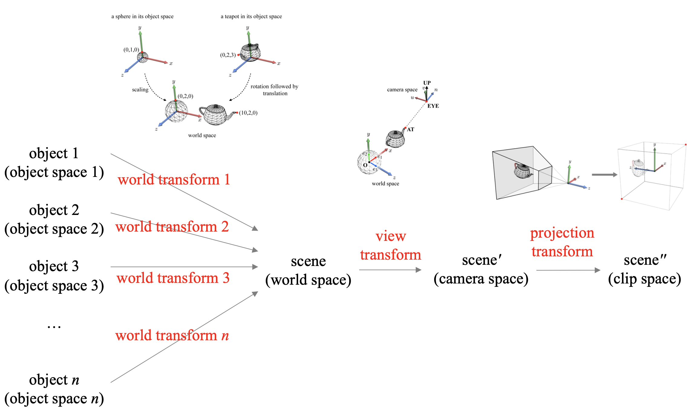
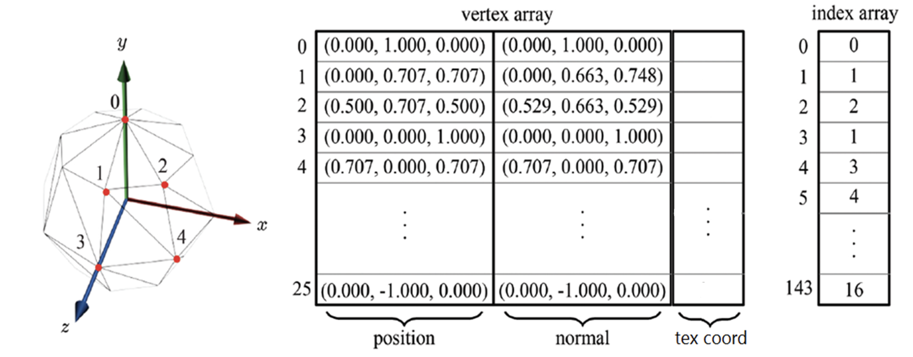
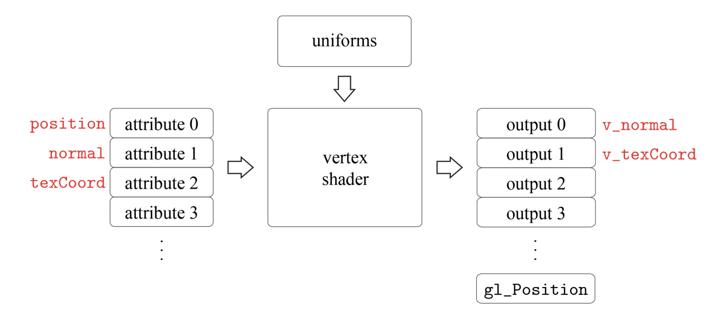
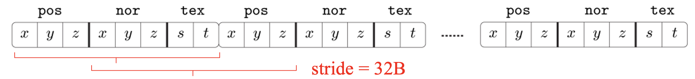

ⓒ 2019. [JungHyun Han](https://media.korea.ac.kr/people/jhan/) Korea University Seoul, All rights reserved.

<br/>


## GPU Rendering Pipeline, All Transforms


- 물체가 n개라면 n번의 world transform이 일어날 것이다.

<br/>

## Vertex and Index Arrays


- texture coordinate라는 좌표도 vertex array에 각 셀에 같이 입력되는데, position, normal과 함께 필수 요소라고 볼 수 있다.

- **GPU는 parallel 프로세서**이기 때문에 각 vertex들이 병렬적으로 처리될 수 있다.

<br/>

## OpenGL ES

Vertex Shader와 Fragment Shader는 결국 프로그램이기 때문에, 각자가 스스로 API에게 제공을 해야 시스템이 돌아간다.

- Shader를 짜기 위한 GPU에 특화된 언어를 사용해야하는데, 이를 OpenGL ES Shading Language라고 한다.(**GLSL**)

### OpenGL ES Shading Language(GLSL)

GLSL은 C언어와 상당히 유사한 면이 있다. 하지만, GLSL은 GPU를 가동시키기 때문에, CPU를 가동시키는 언어들과는 차이가 있을 수 밖에 없다.

- `vec4` 4차원 vector를 제공
- `ivec3` 정수형 3차원 vector 제공

- `mat3`, `mat4` 정사각 행렬
- `mat3x4` 3x4 행렬

<br/>

## Vertex Shader 



**Two major inputs**

- **Attributes** : Vertex array를 구성하는 종류들 (ex, position, normal, texture coord) -> 각각의 vertex마다 다 attribute가 다르다.

- **Uniforms** : 각각의 데이터들을 똑같이 적용해야하는 shader의 excution들을 칭한다. (ex, World transform, Projection, view transform)

클립공간에서 정의된 좌표를 출력하는 일은 vertex shader의 의무이다. 해당 좌표들을 bulit-in 변수에 저장한다.

```c
#version 300 es

uniform mat4 worldMat, viewMat, projMat

layout(location = 0) in vec3 position;
layout(location = 1) in vec3 normal;
layout(location = 2) in vec2 texCoord;

out vec3 v_normal;
out vec2 v_texCoord;

void main(){
    gl_Position = projMat * viewMat * worldMat * vec4(position, 1.0);
    v_normal = normalize(transpose(inverse(mat3(worldMat))) * normal);
    v_textcoord = textCoord;
}

```
- 3차원 좌표 position, 3차원 좌표 normal, 2차원 좌표 textCood를 attribute로 받는다.

- in은 입력, out은 출력이다.

- gl_position값을 얻기 위해서는 행렬 곱을 해야하는데, 선언된 position은 3x3 행렬인 Cartesian 좌표이고, 4x4행렬과 결합을 하기 위해서는 homogeneous coordinate로 바꿔줘야 한다.

- `vec4(position, 1.0)` 이라는 명령어를 통해 바꿔줄 수 있겠다.

- normal에 대해서는 우리가 배웠듯이 `L` 파트가 필요한데, 이를 `mat3(worldMat)`을 통해서 4x4행렬의 왼쪽 위 부분의 3x3부분을 뽑아낼 수 있다.

- inverse Transpose를 진행해야 v_normal이 나올 것이다.

<br/>

## GL Program(GL API)

- GL 명령어는 앞에 gl이 붙는다.
- GL 데이터 타입에는 앞에 GL이 붙는다.

Shader Object를 만들어야 하는데, `glCreateShader`라는 함수를 통해 만들 수 있다. 이는 `glCreateShader(GL_VERTEX_SHADER)` 이런식으로  안에 argument를 넣어서 만들면 vertex shader과 fragment shader를 구분할 수 있게 된다.

```c
GLuint shader = glCreatorShader(GL_VERTEX_SHADER);
glShaderSource(shader, 1, &source, NULL);
glCompileShader(shader);
```
- GLuint = GL unsigned integer type

- shader object에 실제로 shader코드를 저장하는 것 `glShaderSource`, `&source`를 통해 소스코드를 저장할 수 있다.

- glCompileShader를 통해 compile 할 수 있다.

### Program Object

- vertex shader와 fragment shader가 만들어진 후에, 이 둘을 붙여서 program object라는 걸로 통합을 해야한다.

```c
GLuint program = glCreateProgram();
glAttachShader(program, shader);
//glAttachShader(program, fragment_shader);
glLinkProgram(program);
glUseProgram(program);
```
- 해당 프로그램에다가 `vertex shader`object를 붙여야 하기 때문에 `glAttachShader`함수를 이용한다. 
- 연결해주기 `glLinkProgram`
- 사용하기 `glUseProgram`

### Attributes

Polygon Mesh의 데이터들을  `.obj`파일을 통해 vertex array와 index array를 import해올 것이다.
- 각각을 가리키는 pointer들을 `vertices`와 `indices`로 설정해보자.
- 각각을 `objData`라는 구조체에 모아져 있다고 해보자.

```c
struct Vertex {
    glm::vec3 pos; // position
    glm::vec3 nor; // normal
    glm::vec2 tex; // texture coordinates
};

typedef GLushort Index;

struct ObjData {
    std::vector<Vertex> vertices;
    std::vector<Index> indices;
};

Objdata objdata;
```
- `glm`는 OpenGL Mathematics를 의미하는데 유용한 유틸리티이다.
 


메모리에 vertex array랑 index array가 로드가 된 것인데, 이를 실제로 렌더링을 진행할 GPU로 옮겨주어야 하는데, 이를 **GPU 메모리에 buffer object를 만든다고 표현한다.**

- Vertex array → array buffer object
- Index array → element array buffer object

```c
GLuint abo;
glGenBuffers(1, &abo);
glBindBuffer(GL_ARRAY_BUFFER, abo);
glBufferData(GL_ARRAY_BUFFER, 
    (GLsizei) objData.vertices.size() * sizeof(Vertex), 
    objData.vertices.data(), GL_STATIC_DRAW);
```
- Buffer를 생성해서 기존 vertex array를 연결해주고, 해당 데이터를 박아 넣는 느낌으로 이해하면 되겠다. 

**index array도 동일하게 진행된다.**



```c
glEnableVertexAttribArray(0); // position = attribute 0
glVertexAttribPointer(0, 3, GL_FLOAT, GL_FALSE,
        sizeof(Vertex), (const GLvoid*) offsetof(Vertex, pos));

glEnableVertexAttribArray(1); // position = attribute 1
glVertexAttribPointer(1, 3, GL_FLOAT, GL_FALSE,
        sizeof(Vertex), (const GLvoid*) offsetof(Vertex, nor));

glEnableVertexAttribArray(2); // position = attribute 2
glVertexAttribPointer(2, 2, GL_FLOAT, GL_FALSE,
        sizeof(Vertex), (const GLvoid*) offsetof(Vertex, tex));
```

- 시작점을 알려주는 것이 굉장히 중요해 보인다.

- `glEnableVertexAttribArray` Vertex array 데이터를 활성화 시키겠다는 것이다.

- Vertex Shader에서 location 0, 1, 2에 position, normal, texCoord를 할당시켰던걸 기억해야한다.

- `3, GL_FLOAT` → 3차원 원소이면서, 각 원소는 float형태이다.

- `sizeof(Vertex)` = stride

- `offsetof()` → 시작지점을 알려주는 함수

<br/>

### Uniform

Our vertex shader has three uniforms: `worldMat`, `viewMat`, and `projMat`.

- 매 씬마다 world matrix는 변동될 것이다.
- 카메라가 움직인다고 생각해봐도 view matrix는 계속 변동될 것임을 알 수 있다.
- projection matrix는 4가지 파라미터, fovy, aspect, n, f 이것들이 변하지 않은 이상 변화는 없을 것이다.

```c
glm::mat4 worldMatrix; // repeatedly updated for a dynamic object

GLint loc = glGetUniformLocation(program, "worldMat");
glUniformMatrix4fv(loc, 1, GL_FALSE, glm::value_ptr(worldMatrix));
```
-  `glGetUniformLocation` 프로그램 오브젝트 world 행렬의 위치를 찾아낼 수 있다.

- `worldMat`과 `worldMatrix`는 다르다. worldMat은 shader가 갖고 있는 변수이고, worldMatrix는 openGL ES가 갖고 있는 변수가 되겠다.

- 위치를 확인한 그 변수를 shader variable 자리에 넣어주면 된다.

<br/>

### Drawcalls

모든게 마무리 되면 이제 그리기만 하면 되겠다.

```c
glDrawArrays(GL_TRIANGLES, 0, 144);
```
- index array없이도 이런식으로 호출이 가능하다.

```c
glDrawElement(GL_TRIANGLES, 144, GL_UNSIGNED_SHORT, 0)

```
- element = 결국 index라는 점을 인지해야겠다.

<br/>


```toc
```