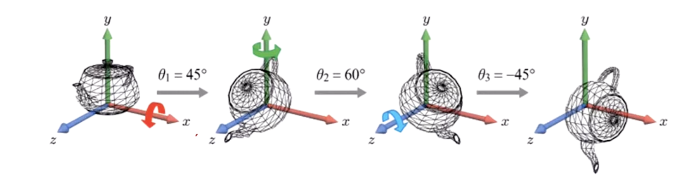
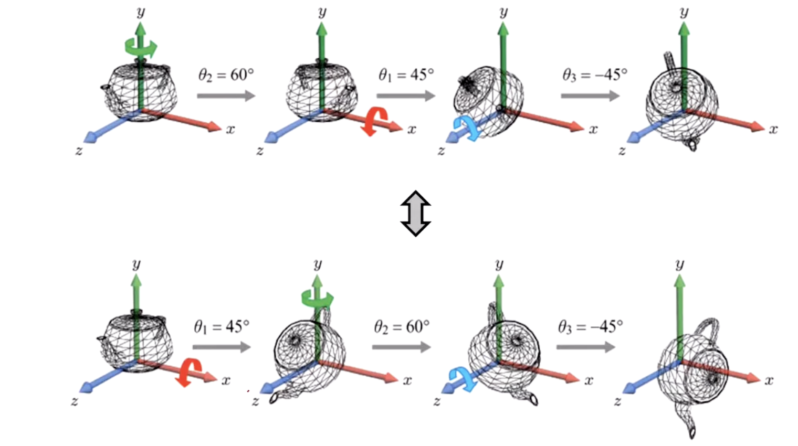
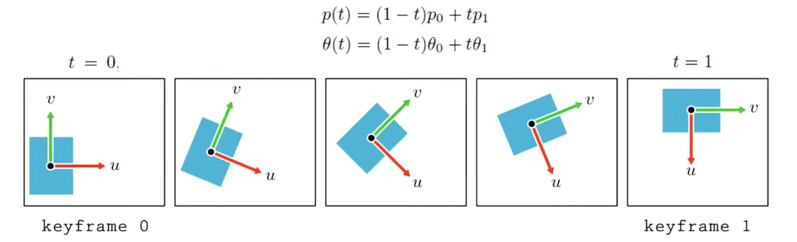
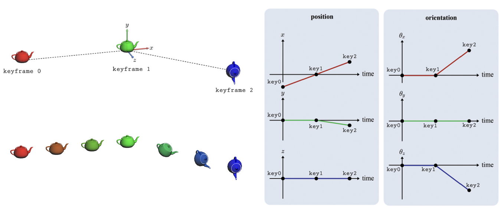
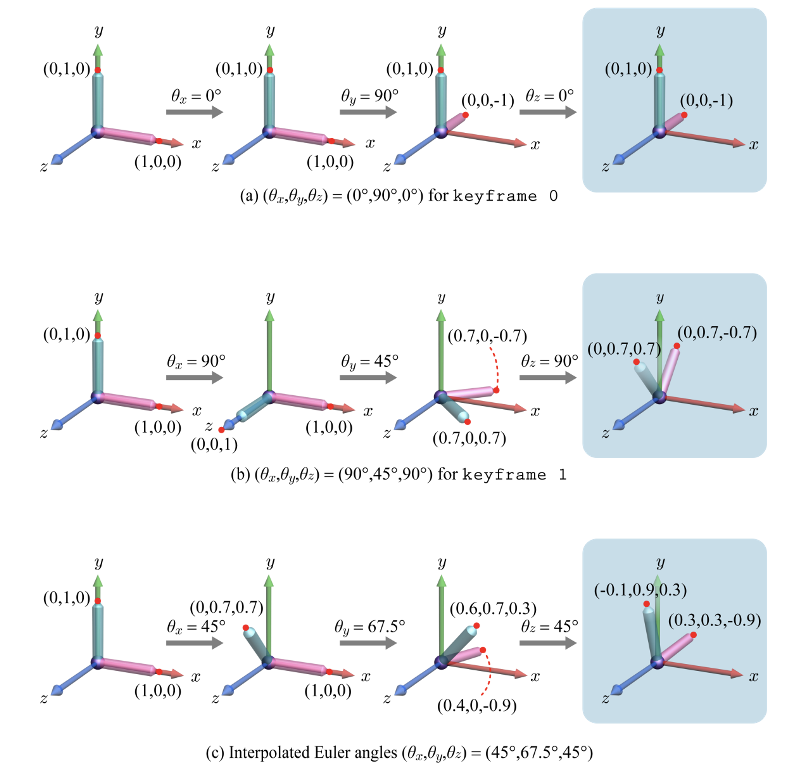
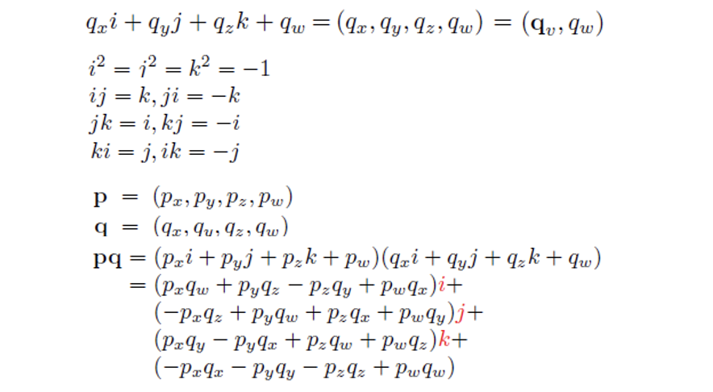
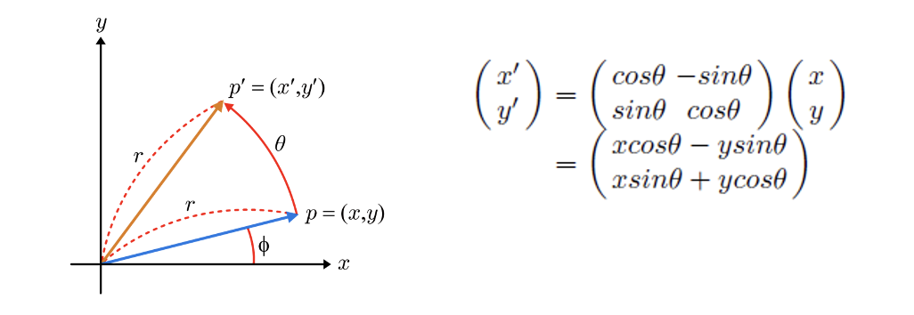
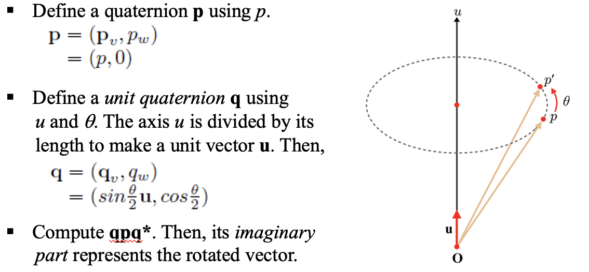
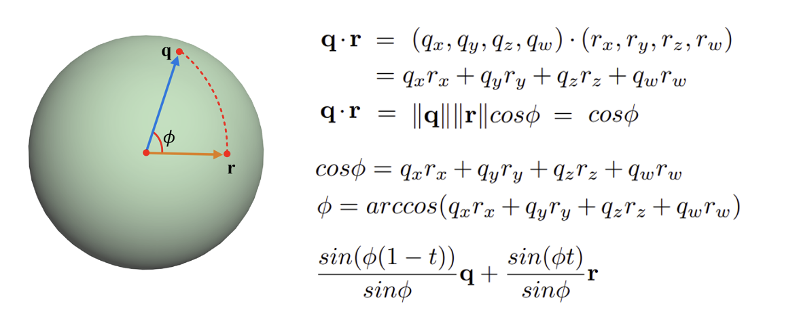
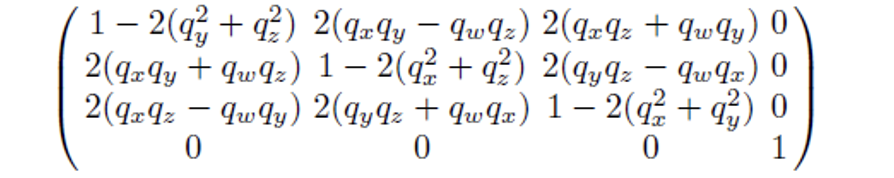

ⓒ 2019. [JungHyun Han](https://media.korea.ac.kr/people/jhan/) Korea University Seoul, All rights reserved.

<br/>


## Euler Transforms

물체를 여러 축(Principal Axes)을 기준으로 연속적으로 회전시킬 때, 물체는 새로운 임의의 방향을 갖게 된다. 이 방법을 통해 물체의 방향을 결정하는 것이 "Euler Transform"이라고 부르기로 함.



- Euler Angle은 여기서 Euler Angles(오일러 각): 회전할 때 사용하는 각도들로, 여기서는 𝜃1, θ2, θ3로 나타낸다. 이 각도들은 각각 다른 축을 기준으로 하는 회전을 가지게 된다.

- 이때 x,y,z에서 어느 축을 먼저 건드리느냐에 따라 결과물이 달라지게 된다.


*축의 순서에 따라 결과가 달라지는걸 볼 수 있다.*

### Key Frame Animation in 2D

고전에는 keyframe에는 메인 keyframe이 있고, 그 메인 keyframe들 사이를 채우는 in-between frames가 있다고 한다.

하지만 요즘에는 real-time computer animation이 이 사이를 다 automatically 채워주기 시작함.
- 여기서 또 중요한 개념이 interpolation이 되겠다.



### Interpolation의 예시



- 위 그림에서 keyframe 0, keyframe 1, keyframe 2 이렇게 3개의 메인 keyframe안에서 in-between keyframe들이 interpolation을 통해 생성되는 것을 볼 수 있을 것이다.

- 꼭 rotation과 Position 뿐만 아니라, 색깔까지도 interpolation이 가능하다.



만약 keyframe0의 위치가 yz평면 위에 위치해 있고, keyframe1의 위치 또한 yz평면 위에 위치해 있다면, 이 중간에 있는 in-between keyframe들은 당연히 yz평면 위에 놓여 있다고 생각이 들 것이다.

- 근데, interpolation으로 중간 frame을 보면, x좌표값이 0.3으로 되어 있는 것을 볼 수 있다.


## Quaternion

쿼터니언은 4개의 성분(x, y, z, w)으로 이루어져 있다. 해당 성분은 벡터(x, y, z)와 스칼라(w)를 의미하게 되고, 아래와 같은 성질들이 나타난다.



해당 성질을 이용해서 역행렬 성질도 볼 수 있다.

**(pq)-1 = q-1* p-1**

- Magnitude : If the magnitude of a quaternion is 1, it’s called a unit quaternion.

<br/>

### 2D Rotation through Complex Numbers



- (x,y)를 x+yi로 나타내고 이를 complex number `p`라고 하자.
- 회전각도 θ를 바탕으로 unit-length complex number을 생각할 수 있는데, 이를 cosθ + sinθi 라고 가정하자.


- 놀랍게도, 실수부와 허수부가 rotation을 의미하겠금 계산된 것을 볼 수 있다.


### 3D Rotation through Quaternions

3D에서는 축이 필요한데, 이 축을 기준으로 θ만큼 회전한다고 가정해보자.


- 이는 꼭 x,y,z축에서만 회전이 가능하게 하는 것이 아닌, 임의의 u축의 회전도 지원하게 된다.

- 일반적으로 벡터는 3차원 공간에서 (𝑝𝑥,𝑝𝑦,𝑝𝑧)와 같은 3D 좌표로 나타낼 수 있는데, 쿼터니언으로 변환할 때에는 𝑝 = (𝑝,0) 와 같이 4D로 확장하게 된다. 𝑝𝑣는 벡터 부분(3차원 벡터), 𝑝𝑤 = 0 는 스칼라 부분을 의미한다.

- 회전을 표현하는 공식인 𝑞𝑝𝑞∗ 를 계산합니다. 여기서 𝑞∗는 쿼터니언 𝑞의 켤레를 의미한다. 계산의 결과에서 벡터 부분은 회전된 벡터를 나타냅니다. 즉, **이 결과의 허수 부분(벡터 부분)**이 우리가 원하는 회전된 벡터 𝑝′를 나타내게 된다.

### Quaternion Interpolation



- 임의의 t값으로 우리는 interpolation을 진행할 수 있다.

- p와 q의 내적 값은 각각이 unit 벡터이기 때문에 그냥 cosθ 임을 알 수 있다. 그렇다면, 두 quarternion의 계산을 arcos계산을 통해 θ값을 역으로 구할 수 있게 된다.

- 구 표면을 이용한 spherical linear interpolation, 이른바 **slerp**이라고 부른다.

4x4행렬로 여태까지 transformation, scaling을 포함한 affine 변환을 다뤄왔다. 만약 quarternion을 이용하게 된다면, 나머지 transformation과 scaling등과는 어떻게 연계를 할 수 있을까?

### Quaternion to Matrix



A quaternion q representing a rotation can be converted into a matrix form. If q = (qx,qy,qz,qw), the rotation matrix is defined as follows.

<br/>


```toc
```