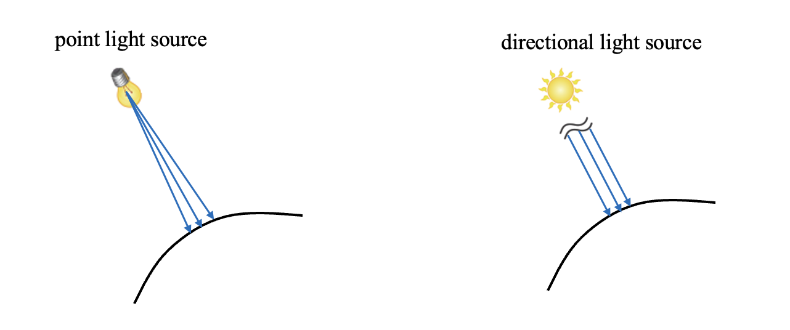
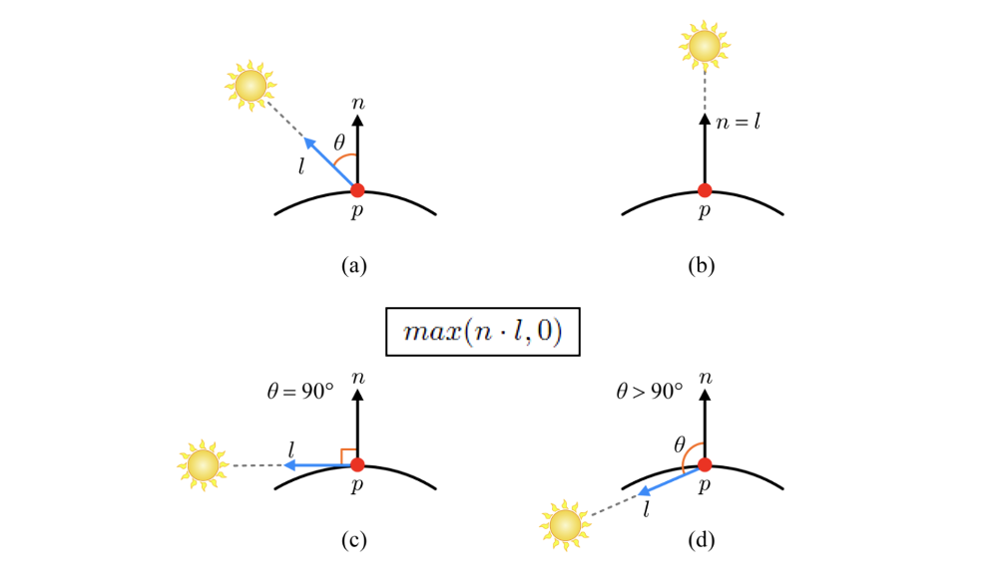
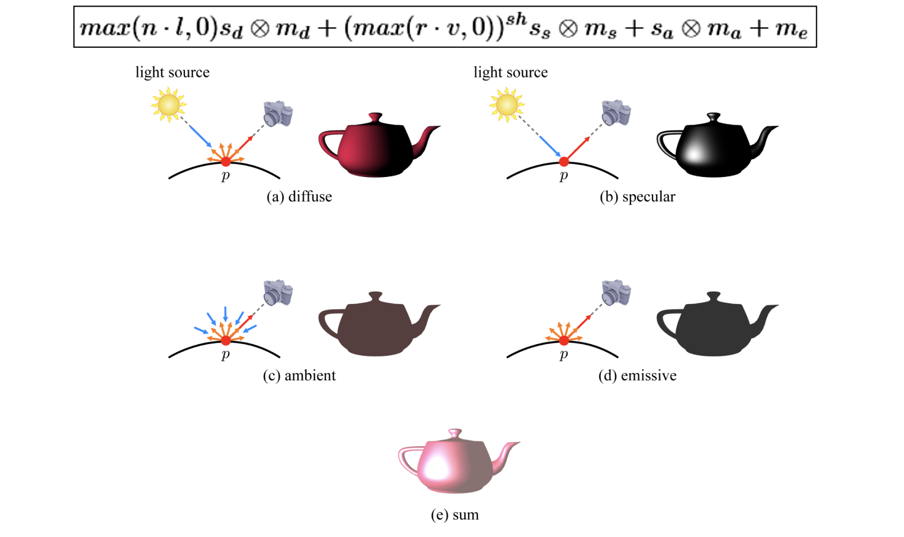
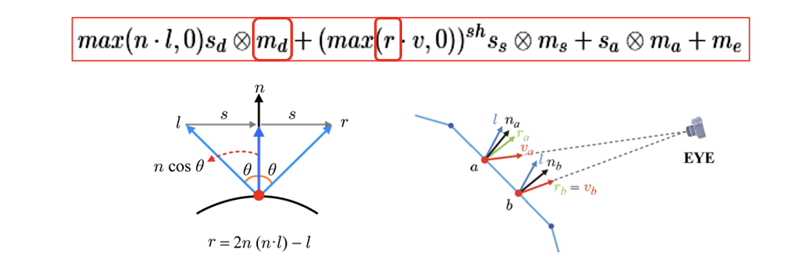

ⓒ 2019. [JungHyun Han](https://media.korea.ac.kr/people/jhan/) Korea University Seoul, All rights reserved.

<br/>


## Lighting

빛과 물체릐 상호작용을 다루는 모든 행위를 lighting이라고 한다.

### Phong Model

가장 유명한 lighting 모델 중에 Phong Model을 자주 쓴다. 

- diffuse
- specular
- ambient
- emissive

### Diffuse Term

**Directional light source** : 워낙 멀리 떨어져있어서 평행하다고 가정하고 한다.


가상카메라가 어디에 있든, 색깔은 동일하다고 볼 수 있다. → 난반사 (Lambertian Surface)
- l을 광원으로 부터는 벡터 방향

- n을 p점의 normal 벡터 방향이라고 하자.



- 이 두 벡터 사이의 각도 세타가 커질수록 빛의 양이 더 작아진다. → **cosθ**

- cosθ에서 θ가 90도를 넘어가면, 0이 그 값이 되겠다.


백색광인 RGB가 (1,1,1)인데, 이 빛을 쐈을 때 물체 표면이 (1,0,0)인 빨간색 물체라면,
(1,1,1) ⨷ (1,0,0) = (1,0,0) 으로 빨간색으로 보일 것이다.

- 표면이 (0.5,1,0)이라면, (1,1,1) ⨷ (0.5,1,0)이므로 (0.5,0.5,0)이 된다.

<br/>

### Specular Term


정반사는 하나의 방향으로 반사되는 현상이기 때문에 카메라가 어디에 위치하느냐가 중요하다.

- 똑같이 빛이 들어오는 벡터를 l이라고 하고,

- p점에서의 n 법선벡터를 설정하면,

- 이 l과 n이 이루는 각도를 θ라고 설정할 때, 이를 입사각이라고 하고,

- 같은 각도만큼 반사각을 이루면서 방향이 설정되어 벡터가 생성될 것이다. 반사벡터 r이라고 하자.

- 해당 점이랑 카메라 위치를 향한 벡터를 v벡터라고 하자.

Specular Term에서 핵심은 v벡터와 r벡터와의 관계이다.


사진에서 보이는 것처럼, view에 매우 크게 의존하기 한다.
- view의 범위에 따라 그 선명도의 차이가 확연히 차이가 있는데, 이를 조정하기 위해 그냥 cos이 아닌, cos에 sh차수가 붙은 함수를 사용해서 조정한다. 이 때 sh는 shininess라고 한다.(얼마나 물체가 매끈하냐)
- 유사하게도, 색상까지 고려를 해야한다.
- 이때 ms는 gray-scale(R=G=B)이어야 한다. → 물체의 특성에 따라 광원 색깔을 흡수하지만, 그래도 광원 그 자체를 표현하는 것이다.
- 밝은 부분은 r과 v가 거의 비슷한 상태를 나타내는 것이다.

<br/>

### Ambient and Emissive 

light source가 어디있는지는 모르겠지만, 물체가 보인다.
- 온갖 방향으로 들어오고, 반사도 온갖 방향으로 반사한다. 배경광 반사라고 생각하면 편할 듯.
- 특정하게 l벡터가 없음.
- n벡터 또한 의미가 사라짐.


- 온갖 방향에서 들어오는 빛을 RGB컬러로 정하면, 물체 고유의 RGB를 곱해서 나타낼 수 있음.

**emissive** : 스스로 빛내는 발광체 → 그냥 그 RGB값을 주면 된다.


*모두 합치면 이런 식으로 Model을 완성할 수 있다.*

### Pre-fragment Lighting

- 해처럼 directional light source를 사용할 것이기 때문에 지점이 어디에 있던, 방향은 똑같이 들어온다고 가정한다. = 동일한 light 벡터 l을 사용 → uniform

- n벡터와 v벡터는 rasterizer를 통과한 이후에 계산된 값을 받을 것이다.

- r벡터는 n과 l 벡터가 주어지면 자체적으로 계산할 수 있음을 알고 있다.

이때, 빛의 벡터인 l벡터는 world space 공간 상에서의 벡터이기 때문에, 이에 맞춰 다른 벡터들도 모두 world space상으로 옮겨져야한다.

- object space에서 world space로의 변환을 진행해야하는데, 이는 결국 vertex shader가 변환해서 던져줘야 한다. (rasterizer는 그냥 interpolation정도만 한다고 생각하면 된다.)


위치 좌표를 object space에서 world space로 vertex shader가 변환을 해준 뒤에, 카메라랑 이어주면서 v벡터를 만들고 이를 rasterizer로 넣어주게 된다.
- 그래서 rasterizer에서는 그냥 하드웨어적 처리로 보간만 하면 된다.


*specular lighting 예시*


<br/>

## Vertex Shader(recap)

```c
#version 300 es

uniform mat4 worldMat, view Mat, projMat;
uniform vec3 eyePos;


layout(location = 0) out vec3 position;
layout(location = 1) out vec3 normal;
layout(location = 2) out vec2 texCoord;

out vec3 v_normal, v_view;
out vec2 v_texCoord;

void  main(){
    v_normal = normalize(transpose(inverse(mat3(worldMat)))* normal);
    vec3 worldPos = (worldMat * vec4(position, 1.0)).xyz;
    v_view = normalize(eyePos - worldPos);
    v_texCoord = texCoord;
    gl_Position = projMat * viewMat * vec4(WorldPos, 1.0);
}
```
- v_view는 eyePos에서 worldPos를 빼서 벡터를 생성하게 된다.
- v_normal 또한 계산되어서 world space기준으로 변환된다.


## Fragment Shader

```c
#version 300 es

precision mediump float;

uniform sampler2D colorMap;
uniform vec3 matSpec matAmbi, mat Emit;  //  Ms, Ma, Me
uniform float matSh; //  shininess
uniform vec3 lightDir;  // Directional light

in vec3 v_normal, v_view;
in vec2 v_texCoord;

layout(location = 0) out vec4 fragColor;
```


- matSpec = Material Specular
- matAmbi = Material Ambient
- matEmit = Material Emission
- matSh = Material Shininess
- srcDiff = source Differen
- srcSpec = source Specular
- srcAmbi = source Ambient
- lightDir = directional light
- n은 rasterizer로부터 받아올 것이고,
- md는 주어지는 것
- v또한 rasterizer에서 줄 것이다.


```c
void main(){
    //normalization
    vec3 normal = normalize(v_normal);
    vec3 view = normalize(v_view);
    vec3 light = normalize(lightDir);

    //diffuse term
    vec3 matDiff = texture(colorMap, v_texCoord).rgb;
    vec3 diff = max(dot(normal, light), 0.0) * srcDiff * matDiff;

    //specular term
    vec3 refl = 2.0 * normal * dot(normal, light) - light;
    vec3 spec = pow(max(dot(refl, view), 0.0), matSh) * srcSpec * matSpec;

    // ambient term
    vec3 ambi = srcAmbi * matAmbi;

    fragColor = vec4(diff + spec + ambi + matEmit, 1.0);
}
```


- rasterizer을 거치면서 vertex shader에서 normalize된 벡터들이 마구잡이로 다시 생성되는 것이다. (단위벡터 성질 모두 사라짐.) 그래서 Fragment Shader에서 normalize 과정을 통해 단위벡터로 만들어주어야 한다.

- 만약 ambient 값들이 다 더했을 때 1.0을 넘어가게 된다면, 그때는 그냥 1.0으로 한다고 생각하고, 결과값을 본 후에 uniform값들을 조정하면 된다.

<br/>

```toc
```