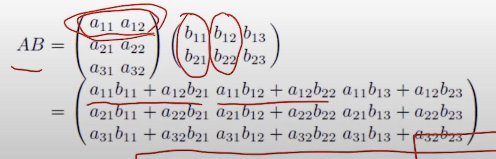
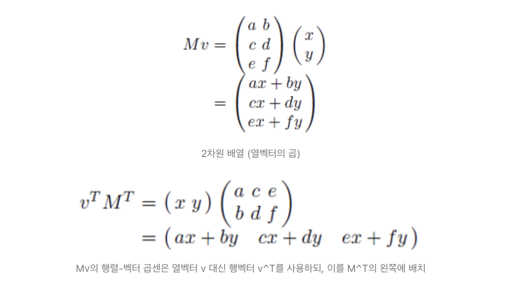
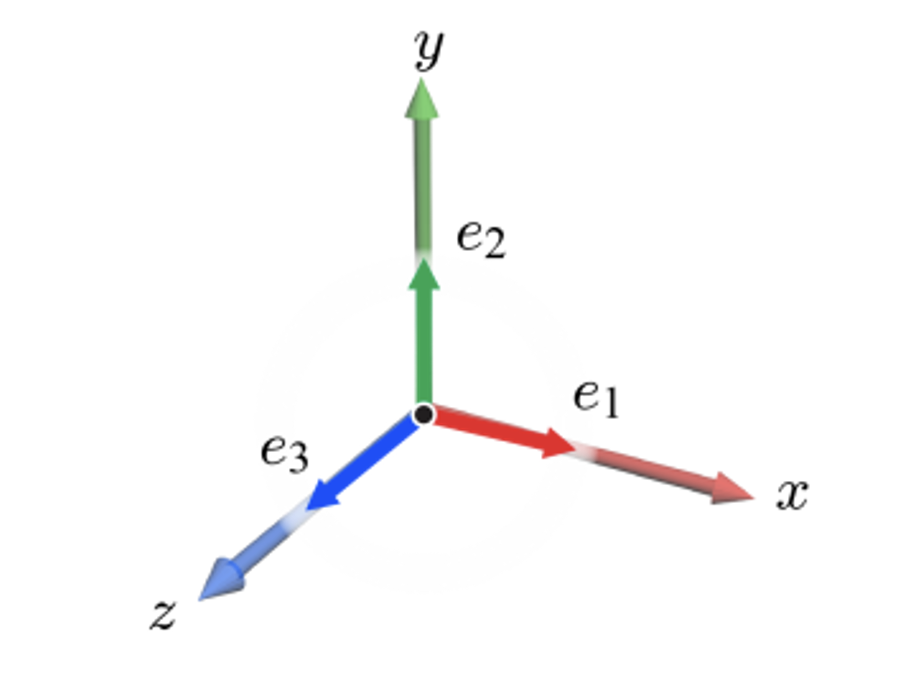
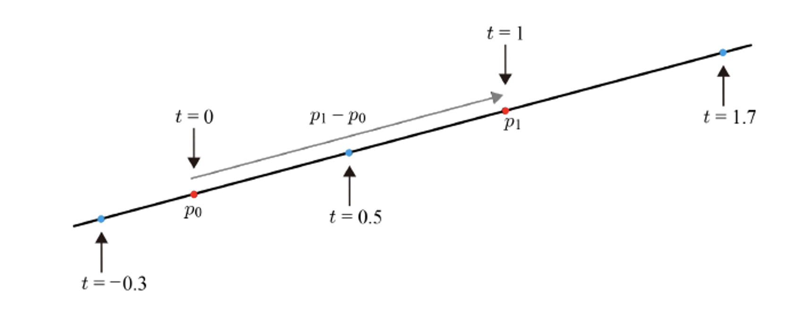
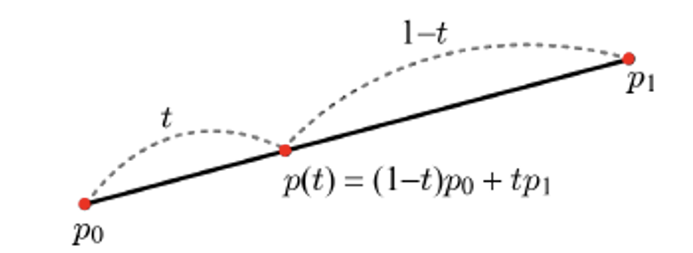
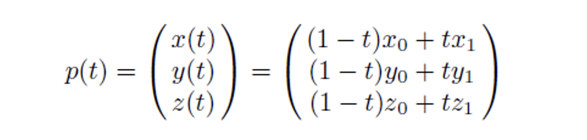
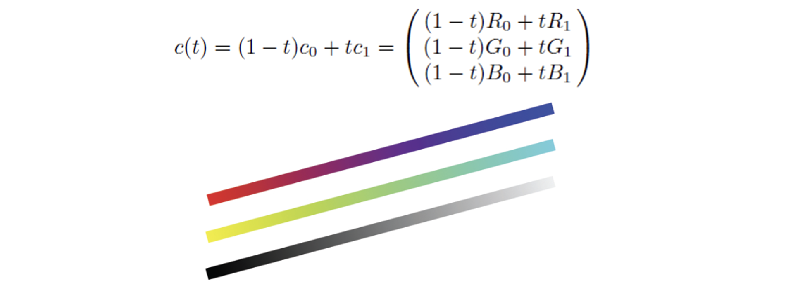

ⓒ 2019. [JungHyun Han](https://media.korea.ac.kr/people/jhan/) Korea University Seoul, All rights reserved.

<br/>


## Matrices and Vectors

m x n 벡터를 표현할 때, m = n 이면 정사각(square) 행렬이라 부른다.



A 행렬의 크기가 l x m 이고, B 행렬의 크기가 m x n 이면,
- A * B = l x n 행렬이 된다.



- **OpenGL은 열벡터를 사용하고, M*V와 같이 행렬-벡터 (vector-on-the-right)곱셈을 사용하는 반면,** Direct3D는 행벡터를 사용하고, V^T*M^T와 같은 방식(vector-on-the-left)을 사용한다.

<br/>


## Coordinate System and Basis
- Coordinate System = origin(원점) + basis(기저)
좌표계 = 공간


- 표준기저에서 보다싶이 e1과 e2가 주축 (principle axis, x축과 y축)에 나란하므로, e1과 e2를 특별히 표준기저(Standard Basis)라고 한다.
- 표준 기저는 **linear combination**을 통해, 2차원 공간의 모든 벡터를 표현할 수 있다.
    - orthogonal + normalized = orthonormal standard
    - non-orthogonal + non-standard(단위벡터가 아님) = non-orthonormal non-standard


### 3차원에서의 좌표계


<br/>

## Line, Ray and Linear Interpolation


- p0와 p1을 잇는 벡터는 p1-p0를 사용하여 정의할 수 있다.

- t는 매개변수이고, 해당 공식은 매개변수 방정식이 되겠다.
- If `t` is in [-∞, ∞], p(t) is an infinite line
- when `t` is restricted to [0, 1], p(t) represents the line segment, which corresponds to the linear interpolation of P0 and P1.
    - P0와 P1의 가중치값으로 생각해도 된다.


## 공간에서 선형보간으로 점의 좌표를 계산
- Linear interpolation in 3D space

- 선형보간은 컴퓨터 그래픽스에서 매우 자주 나오는 개념이니 잘 숙지하자.


*color linear interpolation*


```toc
```