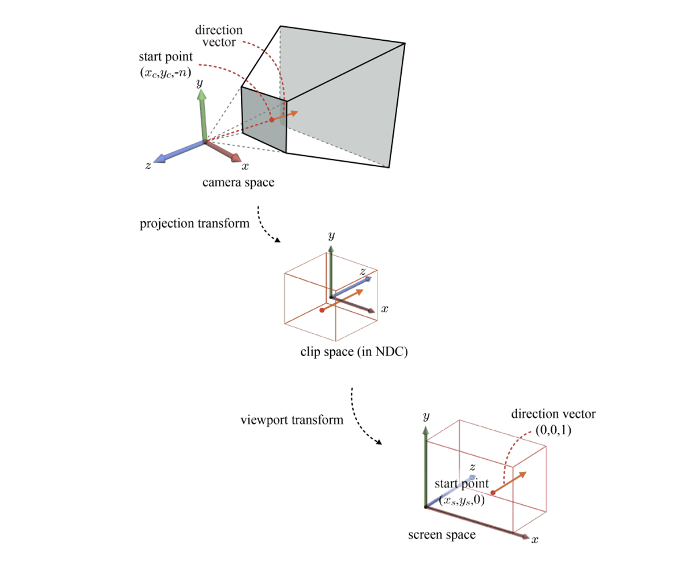
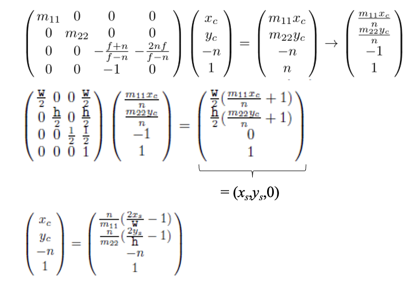

ⓒ 2019. [JungHyun Han](https://media.korea.ac.kr/people/jhan/) Korea University Seoul, All rights reserved.

<br/>


## Object Picking

어떠한 픽셀을 클릭했을 때, 해당 픽셀이 포함된 물체가 선택되는 현상을 구현해보자.


- Ray : 어떤 시작점에서 한쪽 방향으로의 직선. 여기에는 start point랑 Direction vector가 있다고 생각해보자.
- 이 Ray가 쭉 버떠나갔을 때 어디와 마주치는지를 확인해보자.

Object space → World space → Camera space → Clips space → Screen space 이 전체의 스페이스 변환을 보아도 object간 구별을 확인한 적이 없다.

ray-object intersection Test에서 Object가 첫번째로 ray에 닿는 순간을 찾으면 될꺼 같다.
- 하지만 이는 screen-space에서는 해당 정보가 없기 때문에, Object Space공간에서 해결해야 할 것이다.
- screen space에서 클릭이 실행되기 때문에, 해당 과정을 거꾸로 거슬러 올라가야한다.

### Camera-space Ray



- Ray는 카메라 공간으로 변환을 해야한다.

- camera-space ray의 시작점의 z좌표는 -n임을 이용해서 (xs, xc, yc)를 구해볼 수 있다.

- projection transform을 사용해 4x4 행렬 camera-space 시작점에 적용을 하면 clip공간의 시작점을 얻을 수 있다.

- 거기에 viewport transform을 적용하면, 스크린 공간의 시작점을 알 수 있다.


*xc와 yc는 따로 계산되어서 산출할 수 있다.*

추가로, 카메라 공간에서의 projection line은 모두 원점으로 수렴했었던 걸 배웠다. 시작점을 알고 있다면, 원점과 시작점을 잇는다면 그것을 방향벡터로 설정할 수 있다.


*w coordinate가 0이라면 벡터를 의미한다.*

<br/>

### Object-space Ray


<br/>


```toc
```