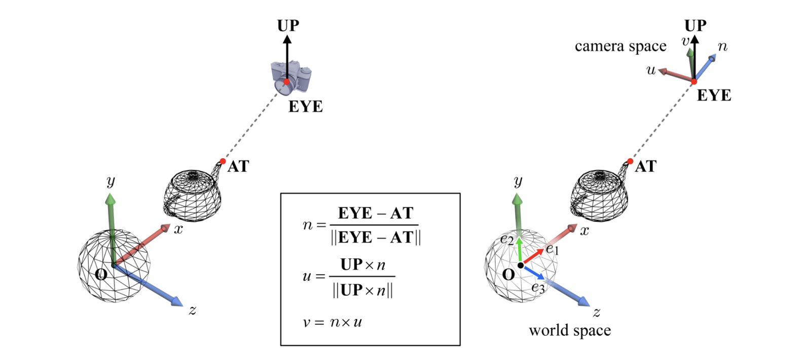
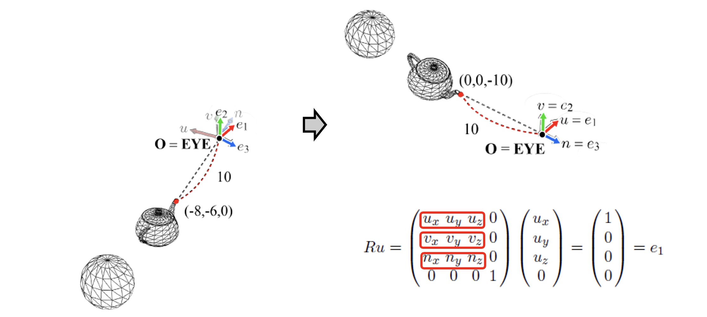
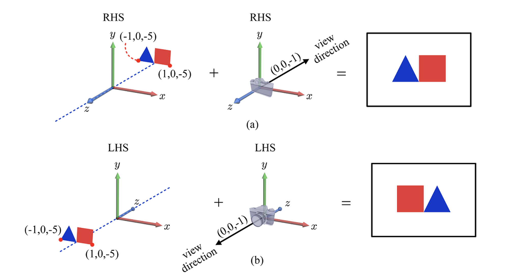
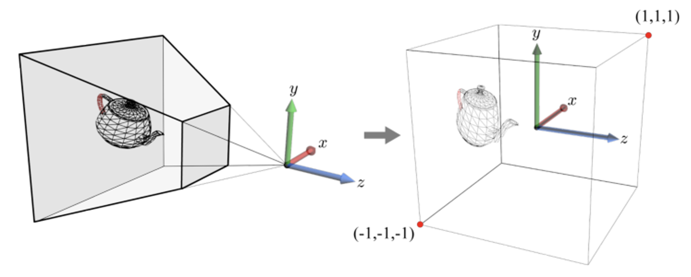

ⓒ 2019. [JungHyun Han](https://media.korea.ac.kr/people/jhan/) Korea University Seoul, All rights reserved.

<br/>


## GPU Rendering Pipeline

GPU 렌더링은 다양한 과정을 걸쳐서 나타나는데, 


1.  polygon mesh가 GPU안으로 입력되면, polygon mesh의 정점들은 vertex array에 저장이 되어 있을 것이다.

2.  해당 정점들을 vertex shader가 한번에 하나씩 불러들이면서 연산을 하기 시작함.

3. rasterizer를 통해 index array에 있는 정보를 바탕으로 삼각형을 조립하기 시작. 조립된 삼각형은 화면 안에서 여러개의 픽셀을 품고 있을텐데, 이때 각각의 픽셀의 색상을 결정할 정보를 rasterizer가 모아서 각 픽셀 위치마다 저장을 해놓는다.(= fragment)

4. fragment shader를 통해서 각 fragment의 색깔을 결정한다.

5. 마지막으로, output merger가 결정된 색상을 보여줄 건지, 말건지를 결정해서 최종 스크린에 뿌려주게 된다.

이 모든 일련의 과정을 **GPU Rendering Pipeline**이라고 한다. 

<br/>

>특히, 이 과정에서 등장하는 shader라는 것은 곧, 프로그램을 의미하기 때문에 프로그램을 짜주어야 한다.
>반면에, rasterizer나 output merger는 하드웨어 그 자체이기 때문에, 정해진 것만 실행하는 역할을 한다고 생각하면 될 것 같다.

<br/>

## Vertex Shader

vertex shader가 작동될 때는, object space에 있는 물체를 clip space로 전환하는 과정이 일어난다.


*OS → WS 과정은 앞에서 배운 것과 동일하다.*

다만, 우리가 배운 transform의 과정에서 normal에 대한 transform은 배우지 않았는데,

- scaling, translation, rotation과 같은 affine 변환을 거친 후에 normal 벡터는, 결국 모든 과정을 거친 행렬을 [L|t] 라고 정의했을 때, `Ln + t`의 공식을 적용할 수 있고, 이때 `+ t` 부분은 아무런 영향을 주지 않기 때문에, `Ln`으로 normal 들이 바뀐다는 것이다.

**만약 non-uniform scaling이라면?**

이 때는 L의 `역행렬 연산` 후 `전치행렬 처리`를 해주면 된다.


- 즉, vertex에 L을 적용할 때, triangle normal에는 L의 `역행렬 연산` 후 `전치행렬 처리`를 적용해야 한다.
- 정점 포지션과, 정점 Normal은 서로 다른 변화에 의해 다른 적용을 연산받아야 한다는 점을 알 수 있다.

**uniform-scaling과 rotation**

여기서는 마찬가지로 동일하게 L을 적용하면 되는데, 위의 경우와 마찬가지로 L의 `역행렬 연산` 후 `전치행렬 처리`를 적용해도 같은 값이 나오므로 헷갈리지 말고 그냥 동일하게,

L의 `역행렬 연산` 후 `전치행렬 처리` 로 외우면 될 것 같다.

> 지금까지는 triangle normal을 기준으로 살펴보았는데, 사실 알고보면 vertex array에 들어가 있는 것은 vertex normal들이기 때문에 vertex normal에 대한 내용을 알아야 한다.


<br/>


### Camera Space

- AT : 내가 기준으로 삼는 3차원 좌표를 AT이라고 한다.

- EYE : 어디를 찍겠다는 것을 그냥 EYE라고 칭한다.

- UP : 카메라의 기울기를 정의할 수 있는 카메라의 법선벡터를 UP이라고 정의한다.



해당 공식을 통해, {u, v, n}은 모두 수직인 관계임을 알 수 있고, 이는 orthonormal하다고 볼 수 있다. 거기에 EYE가 원점 역할을 하기 때문에 완벽한 3차원 좌표계를 구성한다고 볼 수 있다.

- 이때 cross product한 값을 normalize를 하지 않은 이유는, 두 벡터가 이루는 평행사변형의 넓이가 cross product의 값이 되는데 이때 단위벡터 두개가 90도를 이루기 때문에, 넓이 또한 1이 될 수 밖에 없기에 굳이 하지 않아도 되는 것이다.

## View Transform

가장 주된 목표는, 월드 공간에서 카메라 공간으로의 변환이 가장 큰 목표가 될 것 같다.

- 1단계. 원점 맞춰기 (eye = O)
 


- 월드공간 = 카메라 공간을 맞추는 과정에서, 이전에 배웠던 rotation에서 배웠던 e1, e2, e3 벡터와 맞춰지는 공식을 넣어서 생각해볼 수 있을 꺼 같다.
(**space change = translation + basis change**)

- 결론

우리가 원했던 카메라 좌표계의 좌표였는데 이미 두 좌표가 동일하게 된 상태이므로 그냥 월드좌표를 그대로 따오면 될 꺼 같다.

Mview  is applied to all objects in the world space to transform them into the camera space

- 이런 space/basis change는 컴퓨터 그래픽스나 컴퓨터 비전, 증강현실, 로보틱스 모든 분야에 정말 중요한 역할을 한다. (3차원을 다루는 모든 분야)

<br/>

### Right-hand vs Left-hand

RHS 좌표계에서 정의된 것을 LHS로 좌표계를 옮기게 된다면, 이는 다른 현상을 보일 것이다.


- 사실 z좌표 부호만 바꿔주면, 모두 해결되는 것이다.


<br/>

## View Frustum

world space상에서의 x,y,z 축은 이제 의미가 없어진다. u,v,n으로 정의된 축을 바탕으로 카메라가 어느 정도의 공간을 잡아낼 것인지를 결정해야겠다.
- 4가지 parameter로 결정하는데, fovy(field-of-view-yaxis/시야각), fovx, apsect(종횡비)등등이 있겠다.


*실린더 모형의 경우는 시야각 밖에 있기 때문에 구현되지 않는다.*

- 그래픽스 렌더링에서는 시야각의 앞과 뒤를 일부 잘라내서 표현하는데, n과 f의 파라미터는 near plane과 far plane을 의미한다. 모든 물체들은 음의 z축에 있기 때문에, -n과 -f가 되겠다.

*truncated pyramid*

- 이렇게 잘린 피라미드 모형의 시야각 외의 물체들은 내가 안보겠다, 라고 선언한 것과 (처리하지 않겠다.) 동일하게 볼 수 있을 것 같다.

### View Frustum Culling

위에서 언급했듯이 머리 잘린 피라미드 (view-frustum)안에 들어와있는 object들 제외하고, 나머지 물체들을 무시하여 렌더링 제외시키는 것을 의미한다.

**Clipping**

view frustum 안에 있는 object이더라도, 어느 부분은 경계선에 닿아 구현되지 않는 부위가 생길 수 있다. 해당 부위를 잘라내는 행위를 우리는 clipping이라고 한다.

- 하지만, 현재 view frustum의 형태처럼 비스듬히 있는 모형은 정확하게 잘라서 규정하기 어려운 부분이 있다.

<br/>

## Projection Transform



정육면체로 공간을 조정하면, 변환 자체는 안에 있는 object들에게 모두 적용되어야 할 것이다. 이렇게 정육면체로 조정되면 clipping하기 매우 편할 것이다.

우리는 이 조정하는 과정을 **projection transform**이라고 한다.


- 사실 l1과 l2는 원근법에 의해서 길이가 같게 보이는 것인데, projection transform을 하는 순간, 3차원 공간이기 때문에 그냥 같아지는 것이 된다.

컴퓨터 그래픽스에서는 투영을 시킬 때, 3차원의 모습을 2차원으로 바꿔서 투영시키는 방식이 아닌, 3차원을 그대로 유지하면서 투영의 효과(원근법과 같은)를 달성할 수 있는 것이다.


<br/>


따라서 초기에 주어진 **fovy**, **aspect**, **n**, **f** 이렇게 4가지의 파라미터가 주어진다면, 내가 카메라 공간의 어느 부분을 보겠다라는 것을 정의하는 것과 같다. 

- 강체변환(rigid-body)과 비강체변환의 차이를 알 수 있다.

- 레스터라이저에서는 LHS로 하드웨어가 설정되어 있기 때문에, Vertex Shaders는 RHS로 처리된 좌표를 LHS로 변환해서 레스터라이저로 전달해야 한다. (**z-negation**) → only 3행만.


<br/>


```toc
```