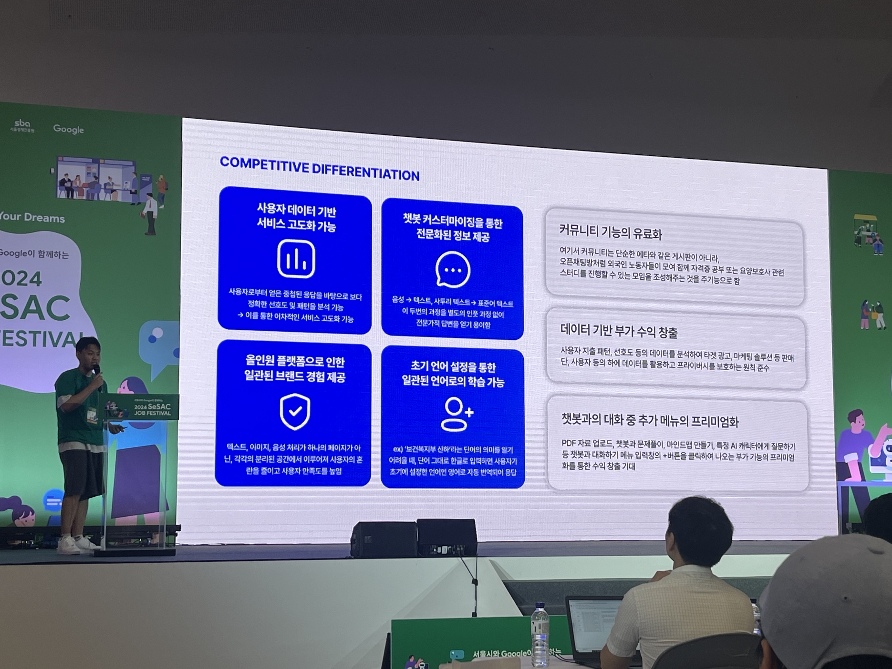
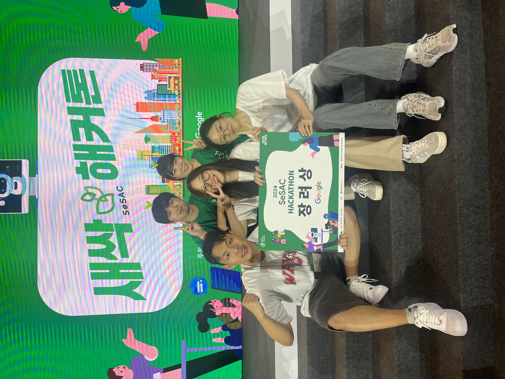

_나의 발표모습ㅎ_

_우리팀의 모습(흰 옷이 접니다)_

## 1. 우승의 기쁨을 맛본 소감을 한마디로 표현해 주세요.

사실 많이 수상을 기대한다기보다, 팀원들과 함께 성장을 하기 위해 나온 자리였습니다. 너무나도 좋게 봐주셔서 수상까지 하게 되어서 정말 잊을 수 없는 경험이었습니다.

## 팀의 이야기를 들려주세요.

저희는 데이콘에서 만들어주신 팀 게더링 단톡방에서 모이게 되었습니다. 제가 편입이라는 긴 여정을 마무리하고 개발자로서의 여정을 다시 시작하는데에 해커톤이 제격이라는 생각에 저는 새싹톤을 지원하게 되었구요. 
저희 팀원 분들 모두 너무 능력자분들이셔서, 제가 최대한 페이스 맞춰가면서 제 능력을 끌어올리기에 정말 최적화 된 팀원분들이었습니다. 다시 한번 감사 인사를 드리고 싶습니다.

## 여러분을 돋보이게 한 특별한 점은 무엇인가요?

저희는 일단 개발을 정말 많이 했습니다. 로그인구현부터 기본적인 어플리케이션이나, 하나의 서비스 완성도를 높이는거에 좀 중점을 두었던 것 같습니다. 해커톤에서는 사실 생각치도 못할 스코프이지만, 저희는 앞서 말씀드렸다싶이 능력을 더 키우기 위해, 성장하기 위해 모였기 때문에 전혀 개의치 않고 정말 하나의 스타트업을 운영하듯이 한땀 한땀 만들어갔습니다. 이런 완성도 있는 서비스의 모습에 심사위원분들께서 감명 깊게 평가해주셨지 않았을까에 대한 기대가 있긴 합니다.

## 이번 성과의 비결은 무엇이라고 생각하시나요?

사실 공모전이나, 해커톤 경험이 다수 있긴 합니다. 제가 생각하기에 가장 중요한 건 남들과 다른 어떤 포인트를 보여주냐의 차이라고 생각합니다. 

어떤 팀이든 그럴싸한 프로젝트를 만들기 마련입니다. 누가봐도 괜찮은 아이디어에 그럴싸한 구현을 해도 떨어지는 경우가 정말 많습니다. 이는 특히 해커톤의 특징이라고 생각이 드는데요, 짧은 시간동안 우리의 서비스를 최대한 어필을 해야하기 때문입니다. 말그대로, 짧은 발표 시간안에 심사위원분들의 머릿속에 남게하려면 결국, 자극적인 발표가 되어야 한다고 생각했습니다.

저희는 이런 부분을 잘 살렸다고 생각합니다. 본선에 올라온 모든 팀들 다 엄청난 아이디어로 굉장한 것들을 만드셨던 거로 기억합니다. 다만 저희 조는 모두가 다 엄청날 때 **저희는 뒤돌아 걸어 돌아가실 때 머릿 속에 자꾸 신경이 쓰이는.."밀당".."썸"이라고 해야할까요.. 자꾸 궁금해지고.. 더 보고싶고...** 그런 발표로 좋은 성과를 얻었던 것 같습니다.

## 대회 기간 중 특별히 기억에 남는 순간이 있다면 공유해 주세요.

제가 중간에 회사 업무 때문에 저녁9시부터 11시까지 자리를 잠시 비우게 되었었습니다. 저희 팀원들이 제가 돌아왔을때 GPT관련 사투리 데이터 연결이 되었다면서 저에게 신난 목소리로 저를 반겨주었을 때 제일 기억에 남는 거 같습니다. 사실 너무 죄송하기도 하고 미안한 마음이 한가득이었는데, 제 무거운 마음도 이때 사라지면서 끝까지 개발 마무리를 할 수 있었던 것 같습니다.

## 데이터 분석이나 학습 과정에서의 나만의 비법이 있다면요?

저는 팀원분들을 잘 따라간 것이 전부라고 생각합니다.. 그리고 팀 프로젝트에서 가장 중요한 건 본인이 버스를 타고 있다고 생각한다면, 계속 핸들을 같이 잡으려고 노력하는 모습이나 시간을 보내면서 struggling 하는 모습이라도 보이는 거라고 생각합니다..아마 팀원들이 버스를 운전해주실 때 제가 그 버스를 잘 탈 수 있었던 비법이라고 해야할까요..

## 수상을 기념하여 빌 수 있는 한 가지 소원이 있다면?

제가 아직 학부생이지만, 더 성장하고 저희 팀원들 모두가 정상에 있을 때 다시한번 모두 모여서 진짜 세상을 혁신하는 그런 서비스를 구상하는 날이 왔으면 좋겠습니다. ㅎㅎ
물론 저부터 빨리 정상으로 가야하겠죠?

## 앞으로의 목표와 꿈을 말씀해 주세요.

저는 카이스트 VR/AR 연구실에서 석사를 졸업하고, 실리콘밸리의 Meta나 Apple에서 증강현실을 설계하고 구상하는 엔지니어가 되는 것이 꿈입니다. 많은 분들이 응원해주시고 있고, 저 또한 이번 해커톤에서의 모습처럼 성실하게 임하다 보면 언젠가 이룰 수 있지 않을까 확신하고 있습니다. 

## 데이콘 커뮤니티에 바라는 점이 있다면 무엇인가요?

새싹톤과 같은 큰 해커톤 운영해주시느라 고생많으셨습니다. 다음에 또 기회가 된다면 다시한번 뵙는 날이 있으면 좋겠습니다 :)